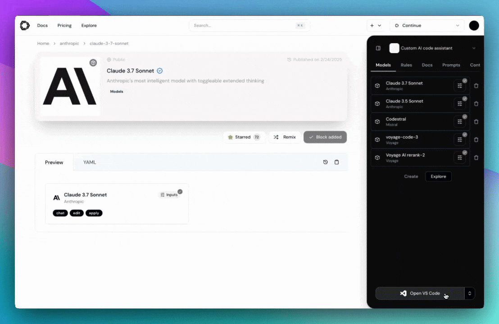

<h1 align="left">Kodemate AI</h1>

**[Kodemate AI]  是公司一款强大创新的AI辅助编程工具，它为开发人员提供了一个便捷、高效且功能丰富的平台，助力开发者在软件开发过程中发挥更大的创造力。借助精心打造的开源 VS Code 和 JetBrains 扩展程序，开发者无需离开熟悉的集成开发环境（IDE），就能无缝接入 [Kodemate AI] 的强大功能。

 

## 对话

 [对话]功能 是 Kodemate AI 基于 VS Code 和 JetBrains 等 IDE 深度定制的智能交互模块，通过快捷键唤起聊天窗口、代码右键菜单或自然语言注释指令，支持开发者在不切换应用的前提下，直接与 ** 大型语言模型（LLM）** 对话，实时获取代码解释、调试方案、功能生成等全流程开发支持。

## 自动补全

[自动补全] 能在你输入代码时提供内联代码建议。

## 编辑

[编辑] 是一种无需离开当前文件即可便捷修改代码的方式。

## A快捷操作ctions

[快捷操作] 是针对常见开发场景的一键式快捷方式，使您能够对代码库进行更实质性的更改

